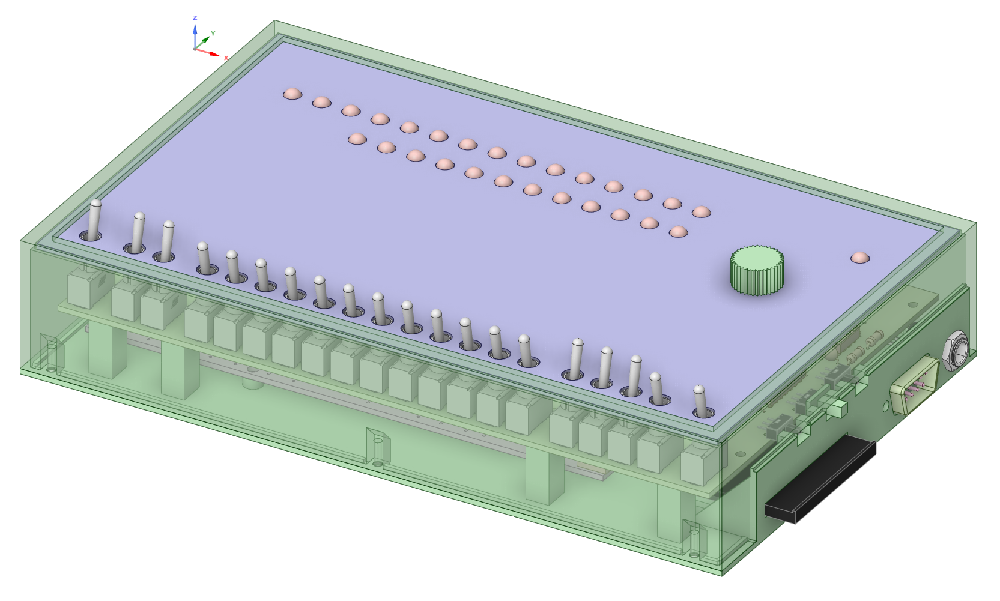
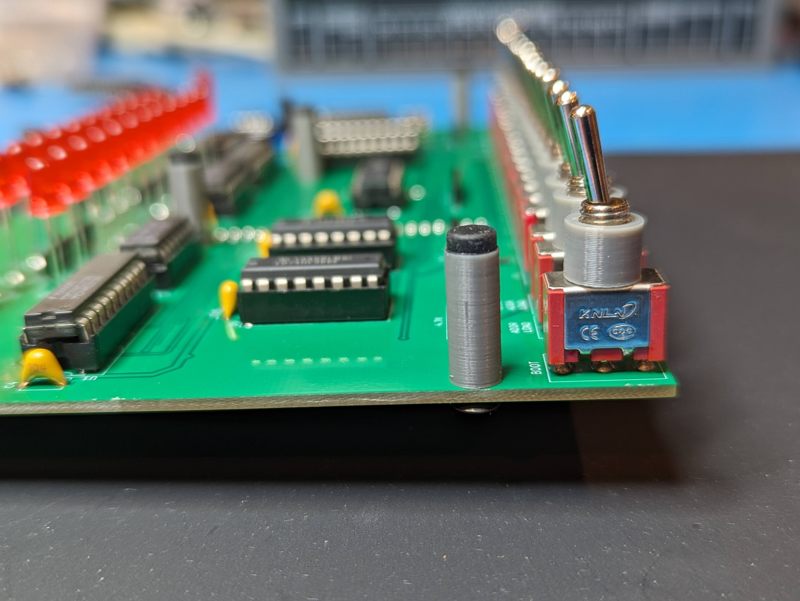
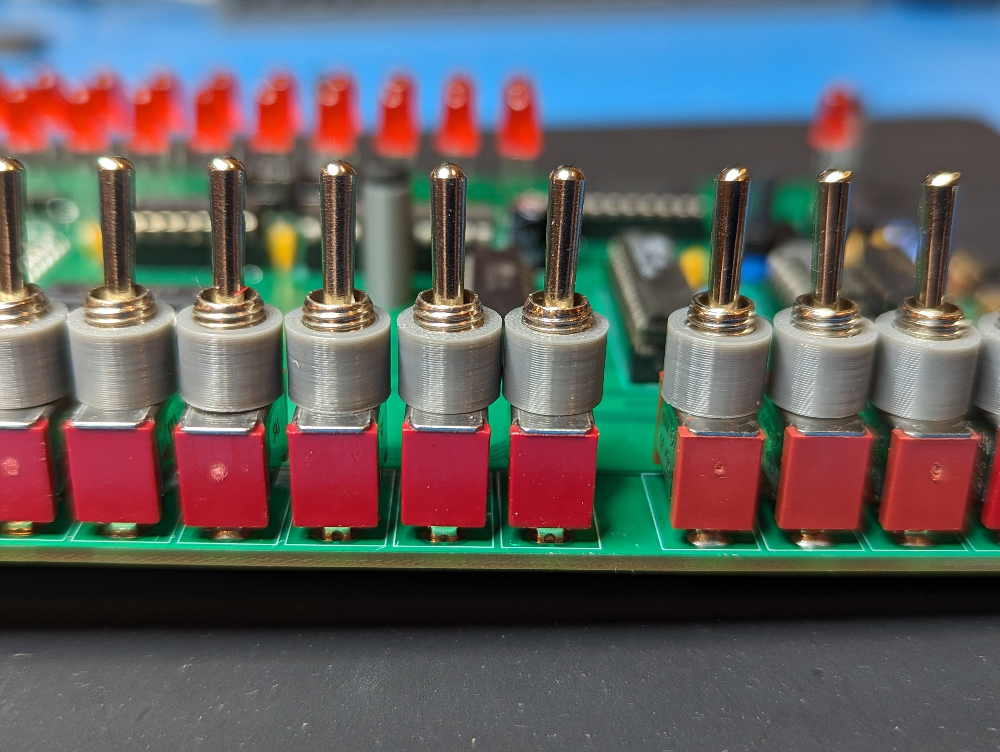
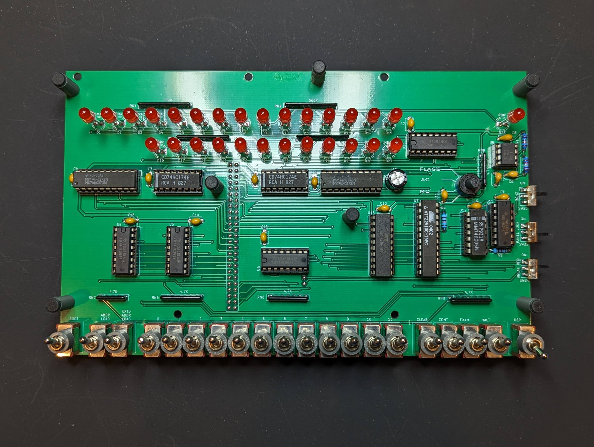
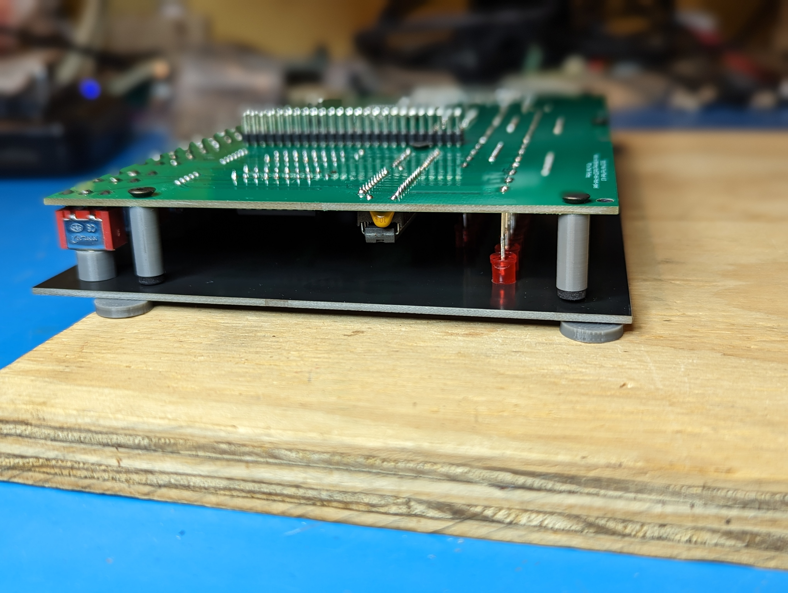
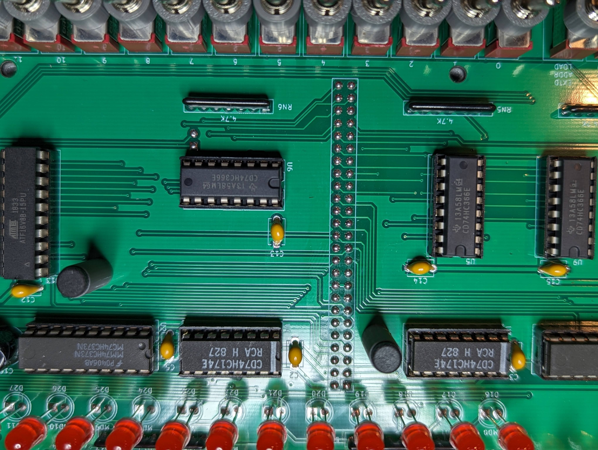
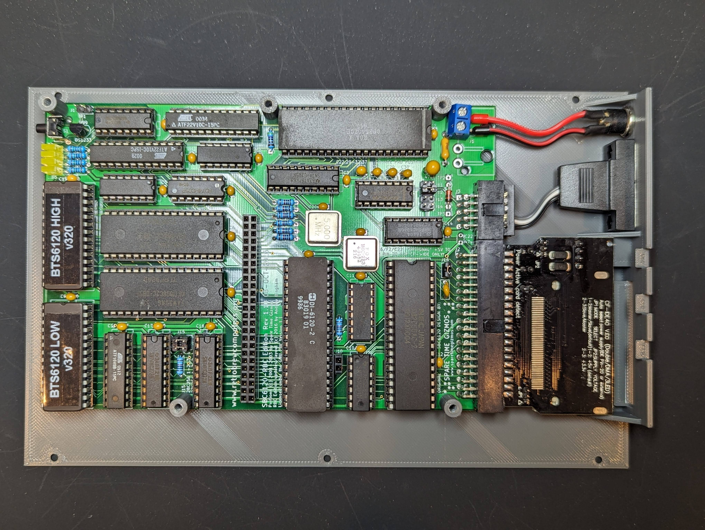
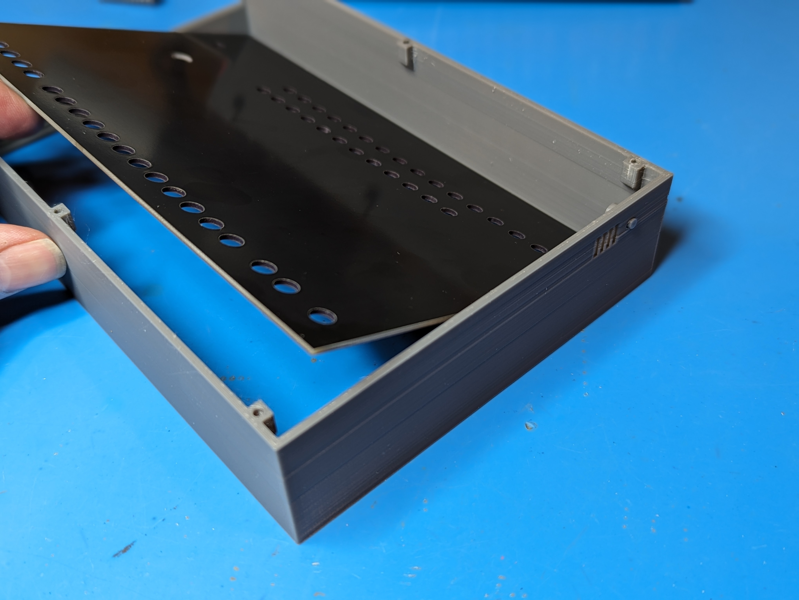
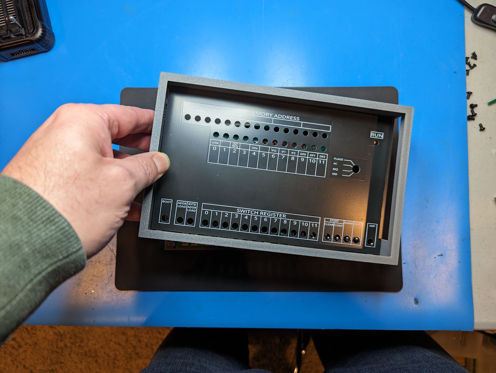
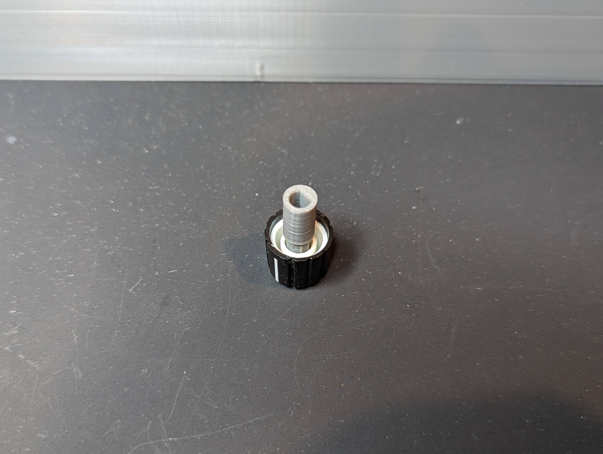

Project thread at https://forum.vcfed.org/index.php?threads/sbc6120-mini-front-panel.1245272/

# Switches

The current PCB and dress panel are drilled for miniature toggles with a 6mm diameter bushing/stem.  1/4-40 switches will NOT fit since I wanted a tight fit on the dress panel and the switches are spaced to tightly to use the dress nuts.  Plus, I think this style looks nicer (same as an Altair 8800).

These are commonly listed as MTS-102 (ON-ON) and MTS-112 (ON-Momentary ON) on AliExpress.  I tried all the different red and blue models and ended up using the red ones linked below in the BOM since they had exactly the same length toggles between the two different models.  Total cost shipped to the US for twenty MTS-102 and ten MTS-112 switches was less than ten bucks, versus the $40 it would cost to buy something like E-Switch 100 Series which was the cheapest domestic option I could find.  C&K 7000 series were over $160 for 20 miniature toggles.  Maybe the action is a bit better, but at the end of the day this is a toy for me, so I would personally rather spend the budget on the next project.

# Electrical BOM

There's an interactive BOM [here](https://djtersteegc.github.io/sbc6120-mini-front-panel/ibom.html), and CSV version with footprint info [here](https://djtersteegc.github.io/sbc6120-mini-front-panel/bom.csv).

I buy pretty much everything from UTSource (for logic) or AliExpress suppliers these days with the exception of the capacitors (whatever is on clearance at Newark) and the rotary switch is only available from C&K.  If you are shopping local everything should be available from Mouser/DigiKey/Newark.

Here is a [shared Mouser cart](https://www.mouser.com/ProjectManager/ProjectDetail.aspx?AccessID=54b04bab67) with all the electrical BOM minus the toggle and slide switches which are a China only part.

C16 is a bulk storage cap for the 5V line.  I specced it at 470uF, but anything from 100uF and up will probably be fine.  You may not even really need it.

| Component                                       | Qty  | Notes                | Link                                                         |
| ----------------------------------------------- | ---- | -------------------- | ------------------------------------------------------------ |
| 10nF Ceramic Capacitor                          | 1    | 5.08mm Lead Spacing  | [AliExpress](https://www.aliexpress.us/item/2251832786944590.html) |
| 100nF Ceramic Capacitor                         | 13   | 5.08mm Lead Spacing  | [AliExpress](https://www.aliexpress.us/item/2251832786944590.html) |
| 1uF Ceramic Capacitor                           | 1    | 5.08mm Lead Spacing  | [AliExpress](https://www.aliexpress.us/item/2251832786944590.html) |
| 470uF 16V Electrolytic Capacitor                | 1    | 3.5mm Lead Spacing   | [Newark](https://www.newark.com/multicomp-pro/mcmr16v477m8x9/cap-470uf-16v-alu-elec-radial/dp/39T1477) |
| 10K 1% 1/4W Resistor                            | 3    |                      | [AliExpress](https://www.aliexpress.us/item/2251832766343175.html) |
| 17.4K 1% 1/4W Resistor                          | 1    |                      | [AliExpress](https://www.aliexpress.us/item/2251832766343175.html) |
| 560R SIP9 Resistor Network                      | 4    | I used 510R          | [AliExpress](https://www.aliexpress.us/item/2251832653789055.html) |
| 4.7K SIP5 Resistor Network                      | 1    |                      | [AliExpress](https://www.aliexpress.us/item/2251832653789055.html) |
| 4.7K SIP6 Resistor Network                      | 1    |                      | [AliExpress](https://www.aliexpress.us/item/2251832653789055.html) |
| 4.7K SIP7 Resistor Network                      | 3    |                      | [AliExpress](https://www.aliexpress.us/item/2251832653789055.html) |
| 5mm LED (Red)                                   | 28   |                      | [AliExpress](https://www.aliexpress.us/item/2255800226642152.html) |
| Miniature ON-ON Toggle                          | 13   | MTS-102 - 6mm        | [AliExpress](https://www.aliexpress.us/item/3256805560180852.html) |
| Miniature ON-(ON) Momentary Toggle              | 7    | MTS-112 - 6mm        | [AliExpress](https://www.aliexpress.us/item/3256802276750993.html) |
| SPDT Right Angle Slide Switch                   | 3    | 2.54mm Spacing       | [AliExpress](https://www.aliexpress.us/item/2251832665517359.html) |
| C&K RM104772BCB Rotary Switch                   | 1    | 4 Position           | [Newark](https://www.newark.com/c-k-components/rm104772bcb/rotary-switch-1p-0-5a-24v-45deg/dp/69AH1990) |
| 74HC05                                          | 1    |                      |                                                              |
| 74HC74                                          | 1    |                      |                                                              |
| 74HC174                                         | 2    |                      |                                                              |
| 74HC366                                         | 4    |                      |                                                              |
| 74HC373                                         | 2    |                      |                                                              |
| 7555 Timer                                      | 1    |                      |                                                              |
| ATF16V8                                         | 1    |                      |                                                              |
| ATF22V10                                        | 1    |                      |                                                              |
| 2x25 2.54mm Pin Header                          | 1    |                      | [AliExpress](https://www.aliexpress.us/item/2251832485909733.html) |
| 1x2 2.54mm Pin Socket                           | 1    | Cut down a 40p strip | [AliExpress](https://www.aliexpress.us/item/2251832484668248.html) |
| 5.08mm 2p Terminal Block (or original 4P Molex) | 1    | KF301-2P (Power In)  | [AliExpress](https://www.aliexpress.us/item/2251832480927324.html) |

# Mechanical BOM

| Component                    | Qty  | Notes                | Link                                                         |
| ---------------------------- | ---- | -------------------- | ------------------------------------------------------------ |
| 12mm M3 Standoff             | 5    | SBC6120 to Panel     | 3D Print                                                     |
| 15.6mm M3 Standoff           | 7    | Panel to Dress Panel | 3D Print                                                     |
| 2mm High M3 Rubber Bumpers   | 7    | TS-2.7 Option        | [AliExpress](https://www.aliexpress.us/item/3256805089368820.html) |
| M3 x 6mm Taper Head Screws   | 12   |                      | [AliExpress](https://www.aliexpress.us/item/3256801858523146.html) |
| M3 x 12mm Taper Head Screws  | 5    |                      | [AliExpress](https://www.aliexpress.us/item/3256801858523146.html) |
| M2.5 x 6mm Taper Head Screws | 6    |                      | [AliExpress](https://www.aliexpress.us/item/3256801858523146.html) |
| 15mm Diameter Knob           | 1    | "Plum Shaft" Option  | [AliExpress](https://www.aliexpress.us/item/2251832788673272.html) |

# Other Parts

| Component                              | Notes              | Link                                                         |
| -------------------------------------- | ------------------ | ------------------------------------------------------------ |
| IDE to CF Adapater                     | CF-IDE40 or HX-168 | [AliExpress](https://www.aliexpress.us/item/3256804514420229.html) |
| DB9 to IDC 10                          | May need to rewire | [AliExpress](https://www.aliexpress.us/item/3256803077047244.html) |
| 5.5 x 2.1mm DC Input Jack for 8mm Hole | DC-025M            | [AliExpress](https://www.aliexpress.us/item/2255801022148508.html) |

# Case

The case is a simple two piece that holds the SBC6120 and front panel PCB securely to the bottom plate, and then the dress panel is held down by pressure around it's perimeter by the case top.  You will need supports on the bottom plate for CF, DB9, and DC power openings, but everything else can be printed without.  I would recommend a 0.2mm layer height since most dimensions are a multiple of that.  The case top and plate are 214mm x 135mm so they should be printable on something like a standard Ender 3.

Total PLA filament usage for all part is ~146 grams according to Cura 5.5.

| Part                              | Qty  | Filament Usage (PLA) |
| --------------------------------- | ---- | -------------------- |
| Case Top                          | 1    | 68g                  |
| Bottom Plate                      | 1    | 64g                  |
| Switch Spacer                     | 20   | 5g                   |
| M3 x 12mm Standoff                | 5    | 2g                   |
| M3 x 15.6mm Standoff              | 7    | 3g                   |
| Slide Switch                      | 3    | 1g                   |
| Reset Button                      | 1    | <1g                  |
| Rotary Knob Adapter               | 1    | 1g                   |
| 2.4mm Spacer for LED Installation | 4    | 1g                   |

Design file are in the [DesignSpark](3D/DesignSpark) folder if you would like to modify further or tweak tolerances for your printer. 

# Assembly

Build the PCB from low to high components, savings the switches, LED's, and pin headers for last. Pay attention to the Run (D28) LED, it's orientation is flipped vs. all the others. The rotary switch has a small notch, it MUST be lined up with the tick on the silkscreen. There is no other keying on this switch so it can be installed incorrectly.

Print out six copies of the [M3 x 15.6mm Standoff](3D/STL/M3%20x%2015.6mm%20Standoff.stl) if you are using the 2mm high rubber inserts on top of them, or use the [M3 x 17.6mm Standoff](3D/STL/M3%20x%2017.6mm%20Standoff.stl) if you are not.

Also print out 20 copies of the [Switch Spacer](3D/STL/Switch%20Spacer.stl).

Screw the standoff into the front panel PCB, place all the switches, paying attention to the ON-ON vs. ON-(ON) models. All momentary switches should face up with the exception of the Dep (SW19) which faces down when not activated.

Slip the 20 switch spacers onto the stems, and place the dress panel so it is resting on top of the standoffs and switch spacers.  It helps to have all the switches facing up (except for DEP), slip the panel over the DEP switch, and then rotate counterclockwise to drop over the rest of the switches.  Flip everything over and rest the dress panel on something to elevate it above your work surface so the switch stems hang down.  I found a 3/4" piece of plywood worked well for this.  While supporting the dress panel, push all the switch PCB lugs down so there is no slack between the top of the switch body, spacer, and dress panel.  This will give you a consistent reveal on the front panel even if the Chinese switch tolerances are a little off and/or switch won't sit flat on the PCB due to excess sealing epoxy applied on the bottom of it.  Solder them all in.  I did one terminal each, flipped over to check my work, and then did the rest.

For the LED's, remove the dress panel, drop in the 28 LED's (since I was using cheap Chinese one's I tested them all before to make sure they were all the same brightness, they were), and then flip everything over again until the LED's poke through the dress panel holes.  I elected to have 2.4mm of reveal/protrusion on the LED's, so print out four of the [2.4mm LED Spacer](3D/STL/2.4mm%20LED%20Spacer.stl) pucks and place them under the four corners of the dress panel.  Again, the 3/4" plywood allowed the panel to lay flat while the switches overhung the edge.  Solder one leg each on the LED's, flip over to check your work, and then do the others.

To install the pin headers first print and then install five [M3 x 12mm Standoff](3D/STL/M3%20x%2012mm%20Standoff.stl) on the SBC6120.  I went with 12mm instead of the more common 11mm since my socketed HD6120 was sitting at ~10mm and even after trimming the DIP socket and resistor network leads flush above it, it still seems a little tight for my tastes.  I also switched the CPREQ male header on the SBC6120 to a female header like the 2x25mm and that allowed me to fully install the male headers into both of them, and then place the front panel PCB on top and solder everything up. The header pins should be just flush with the top of the front panel PCB, not protruding like you would see with a normal install.

At this point you can install your IC's and make sure everything works.  JED files for the ATF16V8 and ATF22V10 are in the [Original STG FP6120 Files/pld](Original%20STG%20FP6120%20Files/pld) folder.  ATF16 gets decode.jed, ATF22 is control.jed. Now onto casing your new toy.

Plug the CF adapter, DB9, and DC input jack into the SBC6120.  Remove the 12mm standoffs, and install the SBC6120 to the [Bottom Plate](3D/STL/Bottom%20Plate%20-%20CF-IDE40.stl) with five M3x12mm screws into the bottom of the standoffs.

Slip three of the [Slide Switch](3D/STL/Slide%20Switch.stl) extenders onto the switches and install the front panel PCB onto the SBC6120.  Secure with five M3x6mm screws.

Angle the dress panel PCB into the [Top Case](3D/STL/Top%20Case.stl) and make sure it fits in the recess at the top.

Install the [Reset Button](3D/STL/Reset%20Button.stl) extender into the hole and then let the dress panel rest at the bottom of the top case on top of the six lugs for the screws. Place over the switches with a similar counterclockwise twisting motion as above, and then push the top case all the way down.

Secure with six M2.5x6mm screws through the bottom of the case.

Finally push the splined portion of the [Rotary Knob Adapter](3D/STL/Rotary%20Knob%20Adapter.stl) into your 6mm knob with the D cut opposite the indicator mark on the switch, and line up the D cut on the rotary switch.

# How do I get some PCB's?

If you are in the US, hit me up on the VCF forum thread above and if I have any extras, I can drop some in the mail for less than the cost of a small run at JLCPCB (size and shipping drive up the costs here).  Otherwise, there are gerber files available for use at your favorite PCB fab.